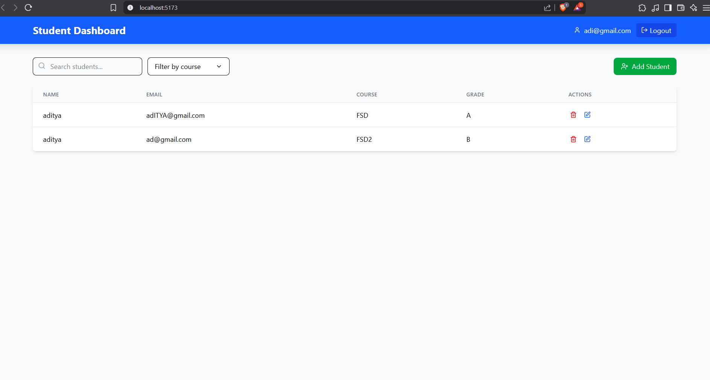

# Student Dashboard Application

A React-based dashboard for managing a list of students with Firebase authentication and Firestore database integration.

## Features



[Live Link](https://studentdb-aditya.netlify.app/)

[Client Repo Link](https://github.com/Aditya-Deshmukh9/student_db_assign)

[Explain UI video](https://drive.google.com/file/d/1441Mw4HwsvLvJbUomDk5RYYhChpWE5zF/view?usp=sharing)

## Features

- **Student Management**:

  - View a list of all students with their details
  - Add new students with form validation
  - Update existing student information
  - Delete students from the database
  - View detailed information for each student

- **Authentication**:

  - Firebase authentication for user login/signup
  - Protected routes for adding, editing, and viewing student details
  - Simple email/password authentication

- **Filtering & Search**:

  - Search students by name or email
  - Filter students by course

- **Responsive Design**:
  - Mobile and desktop friendly UI using Tailwind CSS
  - Modern UI components with smooth transitions

## Technology Stack

- **Frontend**: React 19
- **Styling**: Tailwind CSS 4
- **Authentication & Database**: Firebase (Authentication & Firestore)
- **Build Tool**: Vite 6
- **Icons**: Lucide React

## Getting Started

### Prerequisites

- Node.js (v18 or higher recommended)
- npm or pnpm
- Firebase account

### Installation

1. Clone the repository

   ```bash
   git clone <repository-url>
   cd student_db_assign
   ```

2. Install dependencies

   ```bash
   npm install
   # or
   pnpm install
   ```

3. Set up environment variables
   Create a `.env` file in the root directory with your Firebase configuration:

   ```
   VITE_APIKEY=your-api-key
   VITE_AUTHDOMAIN=your-auth-domain
   VITE_PROJECTID=your-project-id
   VITE_STORAGEBUCKET=your-storage-bucket
   VITE_MSGSENDERID=your-messaging-sender-id
   VITE_APPID=your-app-id
   ```

4. Start the development server

   ```bash
   npm run dev
   # or
   pnpm dev
   ```

5. Open your browser and navigate to `http://localhost:5173`

## Project Structure

- `/src` - Source code
  - `/components` - React components
  - `/context` - Context providers (Authentication)
  - `/utils` - Utility functions and Firebase configuration
  - `/assets` - Static assets

## Firebase Setup

1. Create a Firebase project at [firebase.google.com](https://firebase.google.com/)
2. Enable Authentication (Email/Password)
3. Create a Firestore database
4. Add your Firebase configuration to the `.env` file

## License

MIT
